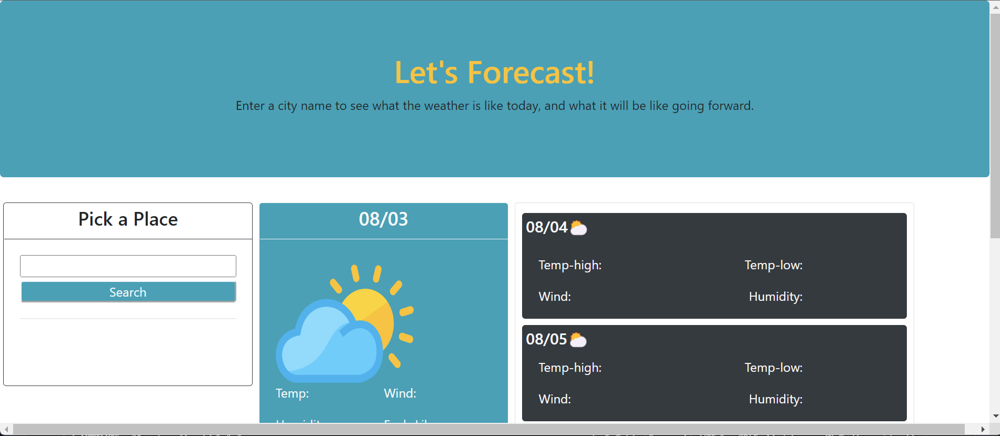

# weather-forecast-challenge6

This was a great intro to hands on experience with server-side api's.

I became comfortable with writing functions that take in parameters so you can substitute user input as an argument later on. I can how important of a concept it can be and feel good about the logic in it.

https://jalenarms1.github.io/weather-forecast-challenge6/

